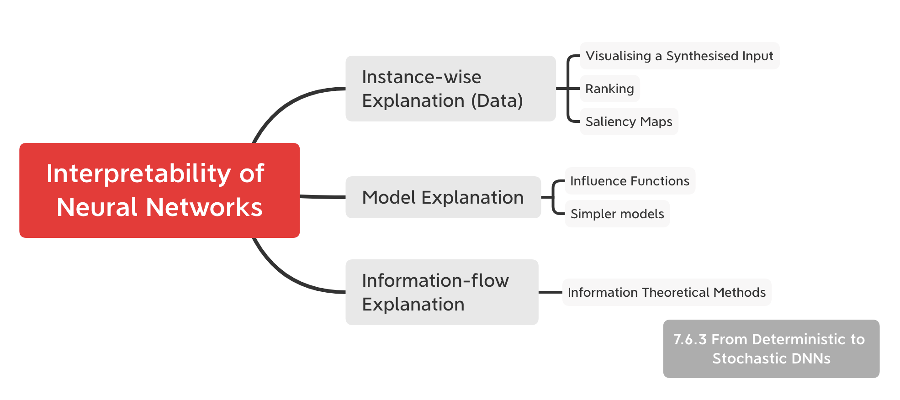

# Safety and Trustworthiness of Deep Neural Networks: A survey*
需要重点看的章节有一、二、三、四、七、八
- [Safety and Trustworthiness of Deep Neural Networks: A survey*](#safety-and-trustworthiness-of-deep-neural-networks--a-survey-)
  * [1. Introduction](#1-introduction)
    + [Verification](#verification)
  * [3. Safety problems and Safety Properties](#3-safety-problems-and-safety-properties)
    + [3.1 Adversarial Examples](#31-adversarial-examples)
    + [3.2 Local Robustnes Property](#32-local-robustnes-property)
    + [3.3 Output Reachability Property](#33-output-reachability-property)
    + [3.4 Interval Property](#34-interval-property)
    + [3.5 Lipschitzian Property](#35-lipschitzian-property)
    + [3.6 Relationship between Properties](#36-relationship-between-properties)
    + [3.7 Instancewise Interpretability](#37-instancewise-interpretability)
  * [4. Verification](#4-verification)
    + [4.1 Deterministic,Constraint,Solvers](#41-deterministic-constraint-solvers)
      - [SMT-based](#smt-based)
      - [MILP](#milp)
    + [4.2 One-sided,lower or upper bound](#42-one-sided-lower-or-upper-bound)
      - [Abstract Interpretation（抽象解释）](#abstract-interpretation------)
      - [Convex Optimisation(凸优化)](#convex-optimisation-----)
      - [Interval Analysis（区间运算）](#interval-analysis------)
      - [Output Reachable Set Estimation(可达性集合估算)](#output-reachable-set-estimation---------)
      - [Linear Approximation of ReLU Networks](#linear-approximation-of-relu-networks)
    + [4.3 Approaches with converging Upper and Lower Bounds](#43-approaches-with-converging-upper-and-lower-bounds)
      - [Layer-by-Layer Refinement](#layer-by-layer-refinement)
      - [Reduction to A Two-Player Turn-based Game](#reduction-to-a-two-player-turn-based-game)
      - [Global Optimisation Based Approaches](#global-optimisation-based-approaches)
    + [4.4 Statistical method](#44-statistical-method)
      - [Lipschitz Constant Estimation by Extreme Value Theory](#lipschitz-constant-estimation-by-extreme-value-theory)
      - [Robustness Estimation](#robustness-estimation)
    + [8. Future Challenges](#8-future-challenges)
      - [8.1 Distance Metrics closer to Human Perception](#81-distance-metrics-closer-to-human-perception)
      - [8.2 Improvement to Robustness](#82-improvement-to-robustness)
      - [8.3 Other Machine Learning Models](#83-other-machine-learning-models)
      - [8.4 Verification Completeness](#84-verification-completeness)
      - [8.5 Scalable Verification with Tighter Bounds](#85-scalable-verification-with-tighter-bounds)
      - [8.6 Validation of Testing Approaches](#86-validation-of-testing-approaches)
      - [8.7 Learning-based Systems](#87-learning-based-systems)
      - [8.8 Distributional Shift and Run-time Monitoring](#88-distributional-shift-and-run-time-monitoring)
      - [8.9 Formulation of Interpretability](#89-formulation-of-interpretability)
      - [8.10 Application of Interpretability to other Tasks](#810-application-of-interpretability-to-other-tasks)
      - [8.11 Human-in-the-loop](#811-human-in-the-loop)

## 1. Introduction

> Trustworthiness = Certification + Explanation

Certification(认证)是使用一系列高等级的规则以保证系统部署的正确性；Explanation(解释)相当于是用户使用说明书，用户可以根据解释理解产品发生的行为。

更多的是Certification，鲁棒性(抗干扰能力)就是一个重要的low-level需求。Explanation非常难，欧盟的通用数据保护法规（GDPR）[GDR，2016年]要求机器学习模型具有“解释权”，这意味着可以要求对模型如何达到其决策的解释。 尽管这种“可解释性”要求绝对对最终用户有利，但对于设计带有ML组件的系统的系统开发人员来说可能很难.可解释的一个例子：银行贷款的AI算法需要告知用户为什么我不合格，是不是带有歧视的成分，比如存在种族歧视的算法无法令人满意。

### Verification
> a provable guarantee can be in the form of either a Boolean guarantee or a statistical guarantee.

这意味着verification有两种解决方法，一种是提供严格的数学证明；一种是提供以概率表示的量化误差(error bound)。
1. 找到DNN的另一种表达方式f，该f比DNN的形式更加容易理解，但携带了必要的信息 7.1 7.2 7.3
2. 找到另一种更简单的模型(model)可以用来推测DNN的结果 7.4 7.5
3. information-flow explanation 7.6

第二章基础知识跳过

## 3. Safety problems and Safety Properties
### 3.1 Adversarial Examples
### 3.2 Local Robustnes Property
### 3.3 Output Reachability Property
### 3.4 Interval Property

### 3.5 Lipschitzian Property
### 3.6 Relationship between Properties
### 3.7 Instancewise Interpretability

## 4. Verification
该文将不同的验证方式根据它们所使用的不同的技术分为4个种类：
1. constraints solving
2. search based approach
3. global optimisation
4. over-approximation

如果根据验证结果来分类，也可以分为4类：
1. Exact deterministic guarantee(确定性保证)：明确表明性质是否成立
2. One-sided guarantee(单向保证)：对变量有上界或者下界的约束，是充分条件，但不构成必要条件
3. A guarantee with converging lower and upper bounds to a variable: 变量上下界收敛
4. A statistical guarantee quantifying the probability that a property holds.

2,3可以验证Reachability property, Interval property, Lispchitzian property.

### 4.1 Deterministic,Constraint,Solvers
第一种是确定性的，由于该类验证的通用做法是将验证问题转化为约束求解问题，求解器给出的结果是确定的（满足或者不满足）。目前有各种约束求解器，如LP solvers，MILP solvers，SMT solvers。
#### SMT-based

1. 基于SMT求解器的抽象精化方法（仅需证明抽象模型是安全的，则具体模型也是安全的，DNN->线性运算的布尔组合，用SMT求解），可以解决**interval property和Reachability property**。
2. 专门用于DNN的SMT求解器，修改SMT以支持DNN。类似的工具如Reluplex和Planet。
3. SAT approach： 重点验证robustness to adversarial perturbations

#### MILP
它把每个Relu函数都表示成由4个不等式组成的MILP公式，方法很简单，但是计算效率是个问题。

### 4.2 One-sided,lower or upper bound
虽然该方法只能对变量的约束进行估算，但其应用规模可到10,000个隐藏节点；而且没有浮点数问题所带来的影响。

#### Abstract Interpretation（抽象解释）
Interval、Zonotope、Polyhedron

略

#### Convex Optimisation(凸优化)
转换为凸函数最优化问题解决，主要解决的safety problems是interval property,不擅长output reachability property.

#### Interval Analysis（区间运算）
相比于Constraint-solving方法，该方法可并行化。与interval-based的抽象解释很相似

#### Output Reachable Set Estimation(可达性集合估算)
1. Maximum sensitivity can be computed via solving convex optimisation problems.
2. using a simulation-based method, the output reachable set estimation problem for neural networks is formulated into a chain of optimisation problems.

#### Linear Approximation of ReLU Networks

### 4.3 Approaches with converging Upper and Lower Bounds
4.3和4.4可以处理真实世界的DNN，通常有数百万的隐藏层。4.3的方法可以验证reachability property和interval property。
#### Layer-by-Layer Refinement
基于SMT的逐层精化，逐层分析其安全性（在该文章中安全性即指鲁棒性），它这里的精化是指（深一层的local robustness可以imply 浅一层的local robustness），这类工具有DLV。
#### Reduction to A Two-Player Turn-based Game
#### Global Optimisation Based Approaches
### 4.4 Statistical method
> Achieve statistical guarantees on their results, by claiming e.g., the satisfiability of a property, or a value is a lower bound of another value, etc., with certain probability.
#### Lipschitz Constant Estimation by Extreme Value Theory
可以验证Lipschitz property.
#### Robustness Estimation

### 8. Future Challenges
#### 8.1 Distance Metrics closer to Human Perception
> Well-known metrics including L0,L1,L2,...Linf-norms, it has been argued that better metrics may be needed.
#### 8.2 Improvement to Robustness
> DNN verification and testing tools are able to find e.g., counterexamples to local robustness (i.e., adversarial examples), it is relatively unclear how these counterexamples can be utilised to improve the correctness (such as the local robustness) of the DNN, other than the straightforward method of adding the adversarial examples into the training dataset, which may lead to bias towards those input subspaces with adversarial examples. Section 6.5 reviews a few techniques such as adversarial training.
#### 8.3 Other Machine Learning Models
> Research is needed to consider other types of neural networks, such as deep reinforcement learning models and recursive neu- ral networks, and other types of machine learning algorithms, such as SVM, k-NN, naive Bayesian classifier, etc.
#### 8.4 Verification Completeness
> he properties in Section 3 are expressed in different ways, and for each property, a set of ad hoc analysis techniques are developed to work with them. Research is needed to develop a high-level language that can express a set of properties related to the correctness of a DNN.
#### 8.5 Scalable Verification with Tighter Bounds
> A possible direction will be to develop an abstraction and refinement framework, like [clarke] did for concurrent systems, and it will be interesting to see how it is related to the layer-by-layer refinement.
#### 8.6 Validation of Testing Approaches
#### 8.7 Learning-based Systems
> To analyse such learning-enabled systems, methods are needed to interface the analysis techniques for individual components.

系统级别和组件级别的interface，gap

#### 8.8 Distributional Shift and Run-time Monitoring
#### 8.9 Formulation of Interpretability
> 尽管有[Lipton，2018]之类的综合调查旨在从许多不同角度研究这一概念，但对于可解释性的讨论却没有严格的定义。现有研究能够提供有关DNN的各种局部信息，由于缺乏系统的定义，因此很难将这些作品进行相互比较。近来，已经进行了一些工作以通过单一的，统一的方法来适应几种相似的方法，以进行比较。例如，[Olah等，2017]提出许多可视化方法都是基于具有不同正则化条件的优化，[Lundberg and Lee，2017]使用Shapley值来解释一些具有加性模型的基于属性的方法，并且[ Ancona et al。，2018]使用了经过改进的梯度函数来适应一些基于梯度的方法。虽然对解释性只有一个定义可能是不可行的，但有必要从几个方面正式定义它。

#### 8.10 Application of Interpretability to other Tasks
#### 8.11 Human-in-the-loop
